   <!--  -->
   

   
   
  
   
  
  
   

 
 

  

  

  
  ### 📈 Timeline

  **🔭 Challenging for Incoming Chances 🔭** (Now)   
  **⛺ Boostcamp AI Tech 8th ⛺** (2025.09 ~ 2026.02)  
  **⛺ Boostcamp Web·Mobile 10th ⛺** (2025.06 ~ 2025.08)  
  **🎓 Ajou University Undergraduate 🎓** (2017.03 ~ 2026.02)  
   
   
  
  

  

   

  ### :open_file_folder: Projects & Main Tech Stacks 🛠️

  <!-- 
  
   -->
    
  
  
  
    
  
  

<!--

### Projects as Game Client Developer
#### [모바일프로그래밍 팀프로젝트 "Dungeon Survival"](https://github.com/SyingSHY/2301-MP-RS)

  
**프로젝트 종료 (23년 1학기 / [Progress Presentation PDF](Documents/23-1%20모바일프로그래밍.pdf))**  
: Java 및 Android SDK 기반 로그라이크 서바이벌 게임 - 적 개체 움직임 및 충돌 / 사용자 플레이 기록 관리 등 담당
#### [Immersive Media Programming 팀프로젝트 "Escape!"](https://github.com/SyingSHY/IMP2301-VR)

  
**프로젝트 종료 (23년 1학기 / [Proposal Presentation PDF](Documents/23-1%20IMP%20VR%20Proposal.pdf) / [Final Presentation PDF](Documents/23-1%20IMP%20VR%20Final.pdf))**  
: Unity VR 기반 수집 후 탈출 공포 게임 - 게임 컨셉 기획 / 적 개체 움직임 / 스테이지 진행 등 담당
#### [Immersive Media Programming 팀프로젝트 "AR Playground"](https://github.com/SyingSHY/2301-IMP-AR)

  
**프로젝트 종료 (23년 1학기 / [Final Presentation PDF](./Documents/23-1%20IMP%20AR%20Final.pdf))**  
: Unity AR 기반 모바일 AR 스포츠 게임 - 게임 전체 UI / Scene 전환 및 관리 담당

-----
### Projects as Back End Developer
#### [Media Software Engineering(MSE) 팀프로젝트 "Auction Cook"](https://github.com/SyingSHY/AuctionCook-BE)

  
**프로젝트 진행중 (24년 1학기)**  
: 식재료 실시간 경매 기반 멀티플레이 게임 - Spring Boot 서버 / Redis NoSQL DB
#### [SW캡스톤디자인 팀프로젝트 "SSALON"](https://github.com/lee1684/SKYTeam)  

  
**프로젝트 진행중 (24년 1학기)**  
: 증표 기반 단발성 모임 커뮤니티 앱 - Spring Boot 서버 / MySQL 및 Redis DB / AWS S3 연계 파일 관리 등
#### [소프트웨어공학 팀프로젝트 "바코드 기반 재활용 도우미 앱"](https://github.com/AU2302SE-Team02/TeamProject-Recycle-WebBackend)

  
**프로젝트 종료 (23년 2학기 / [Final Presentation PDF](Documents/23-2%20소프트웨어공학.pdf))**  
: 바코드 및 위치정보 기반 재활용 방법 안내 앱 - Spring Boot 서버 및 Firebase 기반 NoSQL DB 등 담당

-----
### Projects other else
#### [소프트웨어공학 팀프로젝트 "바코드 기반 재활용 도우미 앱"](https://github.com/AU2302SE-Team02/TeamProject-Recycle-AndroidApp)

  
**프로젝트 종료 (23년 2학기 / [Final Presentation PDF](Documents/23-2%20소프트웨어공학.pdf))**  
: 바코드 및 위치정보 기반 재활용 방법 안내 앱 - Android SDK 기반 이미지 내 바코드 인식 / 사용자 데이터 관리
#### [데이터마이닝 팀프로젝트 "보유 게임 기반 스팀 게임 추천"](https://github.com/AU2302DM-TeamKYJ/TeamProject-SteamGameRecommender)

  
**프로젝트 종료 (23년 2학기 / [Final Report PDF](Documents/23-2%20데이터마이닝.pdf))**  
: 사용자 보유 게임 기반 스팀 게임 추천 - 데이터 크롤링 / Frequent Itemset & Association Rule 기반 게임 추천
#### 기계학습 팀프로젝트 "지역별 음성 데이터 학습에 따른 방언 구별 프로그램"

  
**프로젝트 종료 (23년 1학기 / [Final Presentation PDF](Documents/23-1%20기계학습.pdf))**  
: 지역별 음성 데이터 학습에 따른 방언 구별 프로그램 - [AI 허브](https://www.aihub.or.kr/) 데이터 정제 / RNN, LSTM, GRU 등 순환 신경망 담당

**SyingSHY/SyingSHY** is a ✨ _special_ ✨ repository because its `README.md` (this file) appears on your GitHub profile.

Here are some ideas to get you started:

- 🔭 I’m currently working on ...
- 🌱 I’m currently learning ...
- 👯 I’m looking to collaborate on ...
- 🤔 I’m looking for help with ...
- 💬 Ask me about ...
- 📫 How to reach me: ...
- 😄 Pronouns: ...
- ⚡ Fun fact: ...
-->
